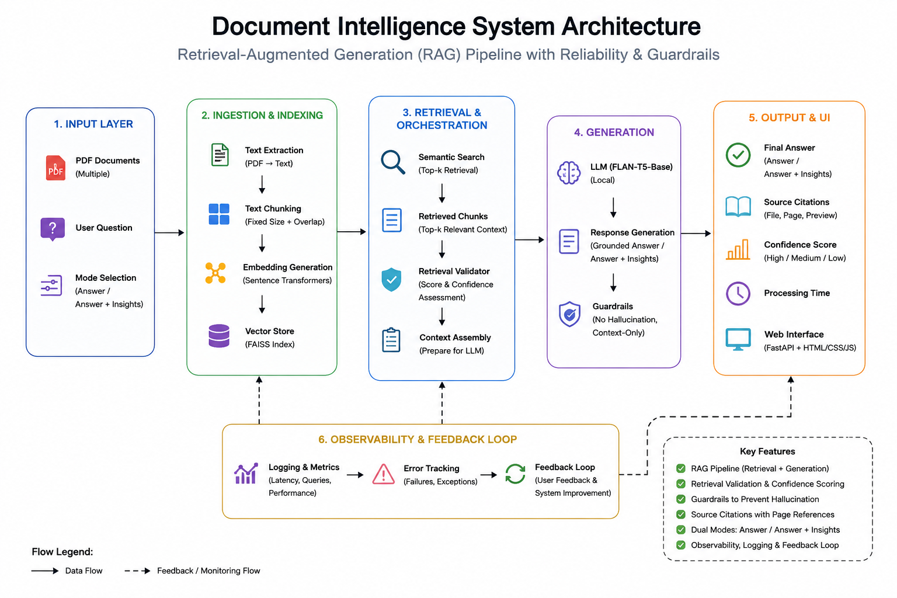

# 📄 Document Intelligence System

<p align="center">

A Retrieval-Augmented Generation (RAG) based Document Intelligence System for PDF Question Answering with Semantic Search, Citations, Confidence Scoring, and Guardrails.

</p>

<p align="center">


</p>

---

# 🚀 1. Project Overview

A lightweight Retrieval-Augmented Generation (RAG) based document intelligence system that enables users to upload PDF documents, ask natural language questions, and receive grounded answers with citations and confidence scoring.

The system emphasizes **accuracy, reliability, and modular architecture** through semantic retrieval, retrieval confidence validation, source citations, and guardrails that reduce unsupported responses.

The system supports two response modes:

- **Answer** – concise grounded answers
- **Answer + Insights** – answer followed by evidence-based insights and recommendations

The implementation is intentionally optimized for **Accuracy** rather than latency.

---

#  2. Features

## Document Processing

- Upload multiple PDF documents
- Automatic PDF parsing
- Text chunking with overlap
- Sentence Transformer embeddings
- FAISS vector indexing

## Question Answering

- Natural language queries
- Semantic retrieval
- Context-aware answer generation
- Source citations
- Retrieval confidence score
- Processing time measurement

## Reliability

- Retrieval validation layer
- Confidence propagation
- Guardrails against unsupported answers
- Duplicate document detection
- Hash-based duplicate prevention
- Comprehensive error handling

## Frontend

- Browser-based interface
- PDF upload
- Question answering
- Citation display
- Confidence visualization

---

#  3. Architecture

<p align="center">



</p>

The architecture follows a modular Retrieval-Augmented Generation (RAG) pipeline where each component is independently responsible for ingestion, retrieval, validation, generation, and response delivery.

### System Flow

```text
PDF Upload
      │
      ▼
PDF Parser
      │
      ▼
Text Chunking
      │
      ▼
Embedding Generation
      │
      ▼
FAISS Vector Store
      │
      ▼
Semantic Retrieval
      │
      ▼
Retrieval Validator
      │
      ▼
Prompt Construction
      │
      ▼
FLAN-T5 Generator
      │
      ▼
Answer + Citations + Confidence
```

---

# 📁 4. Folder Structure

```text
app/
│
├── api/
├── core/
├── schemas/
├── services/
├── utils/
│
frontend/
│
architecture/
│
uploads/
vector_db/
logs/

README.md
requirements.txt
```

---

# 5. Tech Stack

| Category | Technology |
|-----------|------------|
| Backend | FastAPI |
| Frontend | HTML • CSS • JavaScript |
| Embeddings | Sentence Transformers |
| Vector Database | FAISS |
| Language Model | Google FLAN-T5 Base |
| PDF Parsing | PyMuPDF |
| ML Framework | HuggingFace Transformers |

---

# 🔄 6. Pipeline

1. Upload PDF documents

↓

2. Parse PDF text

↓

3. Chunk documents

↓

4. Generate embeddings

↓

5. Store vectors in FAISS

↓

6. Ask natural language question

↓

7. Retrieve Top-K relevant chunks

↓

8. Validate retrieval confidence

↓

9. Construct grounded prompt

↓

10. Generate response using FLAN-T5

↓

11. Return

- Answer
- Citations
- Confidence Mode
- Confidence Score
- Processing Time

---

# 7. Design Decisions

## Accuracy over Latency

This implementation intentionally prioritizes **Accuracy**, as the primary objective of a Document Intelligence System is to provide reliable, evidence-backed answers rather than simply responding quickly.

To improve answer reliability, the system introduces multiple validation layers including semantic retrieval, retrieval confidence validation, grounded prompt construction, citations, and guardrails before answer generation.

This design reduces unsupported responses, increases user trust, and provides greater transparency by exposing both confidence scores and source citations with every generated answer.

## Modular Architecture

Each pipeline stage is implemented as an independent service (Parser, Chunker, Embeddings, Retriever, Generator, Validator), making the system maintainable and easily extensible.

## Retrieval Validation

Instead of sending retrieved chunks directly to the LLM, a Retrieval Validator evaluates retrieval quality, computes similarity-based confidence, and propagates confidence to the final response.

## Grounded Generation

The language model only receives retrieved document context and is explicitly instructed not to use external knowledge.

## Source Transparency

Every answer includes filename, page number, and source preview to improve explainability and user trust.

---

# 8. Tradeoffs

- Selected **FLAN-T5 Base** to enable fully local inference without external APIs.
- Used **FAISS** for simplicity and fast semantic retrieval on moderate document collections.
- Chose fixed-size chunking with overlap for predictable retrieval performance.
- Chose **CPU-based inference**, making deployment easier while increasing response latency compared to GPU inference.
- Built a lightweight **HTML/CSS/JavaScript frontend** to minimize dependencies and keep the project simple.
- Avoided external services to keep the project lightweight and reproducible.

---

# 9. Edge Cases

The system handles:

- Empty uploads
- Upload limit exceeded
- Non-PDF files
- Duplicate documents
- Empty document parsing
- Empty retrieval results
- Irrelevant questions
- Embedding generation failures
- Vector database failures
- File save failures
- Invalid request modes

If insufficient evidence is available, the system returns:

> **"I could not find sufficient information in the uploaded documents."**

instead of generating unsupported answers.

---

# 10. Scalability

The current implementation is suitable for moderate document collections and single-user workloads.

Potential scaling challenges include:

- Large document collections (10k+ PDFs)
- High concurrent user requests
- CPU-only LLM inference
- Single-node FAISS vector database

For production-scale deployments, distributed vector databases, hybrid retrieval, GPU inference, and asynchronous processing would be recommended.

A production deployment could introduce:

- Distributed vector databases
- Hybrid retrieval
- Cross-encoder reranking
- GPU inference
- Async ingestion
- Response caching

---

# 11. Future Improvements

- Stronger instruction-tuned LLMs (Llama, Gemma, Mistral)
- OCR support for scanned PDFs
- Streaming responses
- Docker deployment
- Authentication
- Cloud object storage
- Monitoring dashboard
- Multi-user document collections
- Upgrade to a larger instruction-tuned LLM to improve response quality and structured answer generation while reusing the existing RAG pipeline.

---

# ⚙️ 12. Installation

```bash
git clone <repository-url>

cd document-intelligence-system

python -m venv .venv

source .venv/bin/activate

pip install -r requirements.txt

uvicorn app.main:app --reload --port 8000
```

Start the frontend:

```bash
cd frontend

python -m http.server 5500
```

Open:

```
http://localhost:5500
```

---

# 13. Usage

1. Upload one or more PDF documents.

2. Choose:

- Answer
- Answer + Insights

3. Ask a natural language question.

The system returns:

- Grounded answer
- Source citations
- Confidence
- Confidence score
- Processing time

---

# 💡 14. Example

### Question

```text
What cloud services does Microsoft Azure provide?
```

### Response

```text
Answer

Azure provides cloud computing services including compute,
storage, networking, AI, analytics, security, and hybrid cloud
solutions based on the uploaded document context.

Confidence

High (0.81)

Sources

2025_MicrosoftAnnualReport.pdf
Page 13

2025_MicrosoftAnnualReport.pdf
Page 14
```

---

# 15. What I Would Improve With More Time

- Improve retrieval quality using hybrid search and reranking.
- Replace the lightweight local LLM with a stronger instruction-tuned model.
- Scale the system using distributed vector databases and GPU inference.
- Implement semantic response caching for repeated or similar queries to reduce latency and improve throughput.
- Add Docker deployment, authentication, and cloud storage support.

---

# 16. Model Note

This project uses **Google FLAN-T5 Base**, a lightweight instruction-tuned model selected to enable **fully local, offline inference** without external API dependencies.

While the retrieval, validation, citation, and guardrail pipeline provides grounded evidence to the model, the final answer quality is naturally influenced by the capabilities of the underlying LLM. Smaller models may occasionally produce less consistent formatting or weaker reasoning for complex queries.

The overall architecture is intentionally **model-agnostic**, allowing the generation component to be replaced with stronger instruction-tuned models (such as Llama 3, Gemma, or Mistral) with minimal changes. This would significantly improve answer quality while preserving the same retrieval, validation, and citation pipeline.

The **Answer + Insights** mode uses a lightweight local FLAN-T5 model. While the retrieval pipeline provides grounded evidence and citations, the quality and formatting of generated insights are constrained by the capabilities of the local model. Replacing the local model with a stronger instruction-tuned LLM would significantly improve insight generation without requiring changes to the retrieval pipeline.
---
